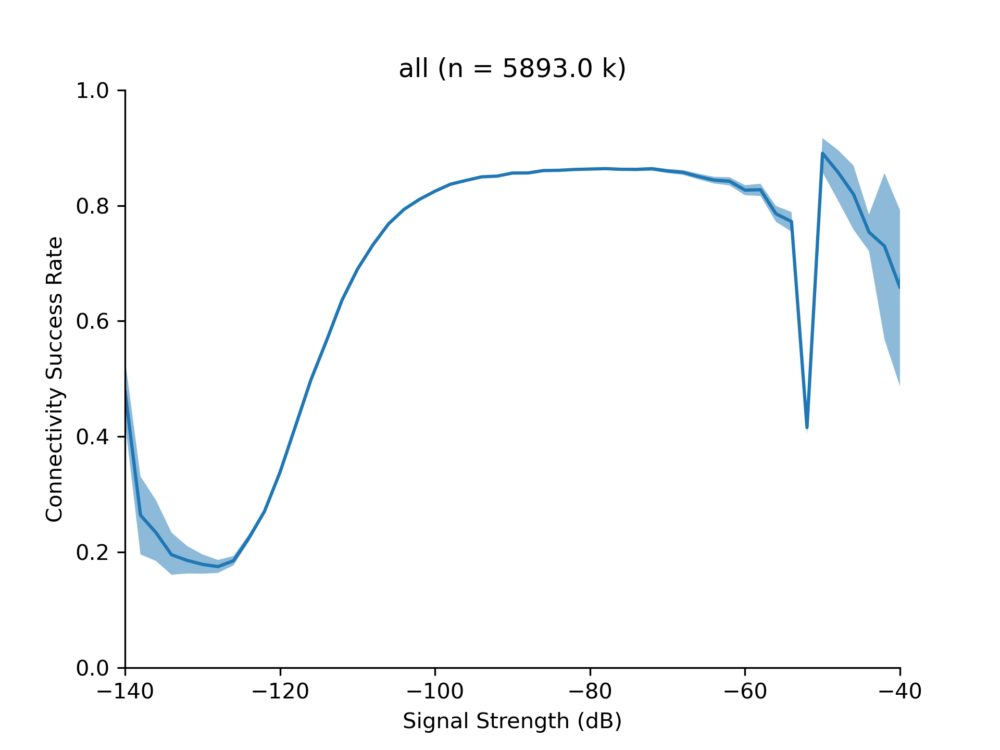

# Analysis of Connectivity with Signal Strength
This is an analysis of how the probability of device connectivity is determined by signal strength. It is an iteration on a previous pilot [Predicting Connectivity from Signal Strength](https://ofcomuk.sharepoint.com/:w:/r/sites/dih/pilots/OpenSignal%20Projects/Technical%20Note%20-%20Predicting%20Connectivity%20from%20Signal%20Strength.docx?d=wa8e9af1e760d466e847c4f3176956599&csf=1&web=1&e=nRioUL). This uses updated Open Signal data according to the query below. 

The images produced are of the form below with additional breakdowns by MNO and technology (3G/4G/5G etc)



# Query
```sql
WITH clean_mno as (select CASE 
    WHEN (Device_SIMServiceProvider = '3' AND  Device_SIMServiceProvider = 'Three Mobile' ) THEN '3'
    WHEN (Device_SIMServiceProviderBrandName = 'O2' AND  Device_SIMServiceProvider = 'O2' ) THEN 'O2'
    WHEN (Device_SIMServiceProviderBrandName = 'Vodafone' AND  Device_SIMServiceProvider = 'Vodafone' ) THEN 'V'
    WHEN (Device_SIMServiceProviderBrandName = 'EE' AND  Device_SIMServiceProvider = 'EE' ) THEN 'EE'
    ELSE CONCAT('raw_',Device_SIMServiceProviderBrandName,'_',Device_SIMServiceProvider) 
END
 as cleaned_mno,CASE 

      WHEN Connection_Category = '4G' THEN '4' 
      WHEN Connection_Category = '5G NSA' THEN '4' 
      WHEN Connection_Category = '5G' THEN '5' 
      WHEN Connection_Category = '5G SA' THEN '5'
      WHEN Connection_Category = 'FIVEG_UNKNOWN' THEN '5' 
      WHEN Connection_Category = '3G' THEN '3'
      WHEN Connection_Category = '2G' THEN '2' 
      WHEN Connection_Category = 'CALL_SERVICE_ONLY' THEN 'C' 
      WHEN Connection_Category = 'NO_SERVICE' THEN 'NO'
      ELSE Connection_Category 

    END AS Connection_Category_clean,

 CASE
    WHEN (QOS_UploadThroughputTestStatus = 'COMPLETED') THEN 0
    WHEN (QOS_UploadThroughputTestStatus = 'TIMEOUT_CONNECTING_TO_REMOTE') THEN 1
    WHEN (QOS_UploadThroughputTestStatus = 'SOCKET_OPEN_FAILURE') THEN 2
    WHEN (QOS_UploadThroughputTestStatus = 'TIMEOUT') THEN 3
    WHEN (QOS_UploadThroughputTestStatus = 'UPLOAD_RESPONSE_ERROR') THEN 4
    WHEN (QOS_UploadThroughputTestStatus = 'CONNECTION_CHANGE') THEN 5    
    WHEN (QOS_UploadThroughputTestStatus = 'SERVER_ERROR') THEN 6
    ELSE -1
 END as test_status,*
 
 FROM `onx-ofcom-uk.ONXData.UnitedKingdom_Mobile_Last365Day`) SELECT count(1) as c, cleaned_mno,test_status,QOS_SignalStrength,Connection_Category_clean FROM clean_mno 
 WHERE QOS_UploadThroughputTestStatus IS NOT NULL AND QOS_SignalStrength IS NOT NULL 
 GROUP BY cleaned_mno,test_status,QOS_SignalStrength,Connection_Category_clean
 ```
